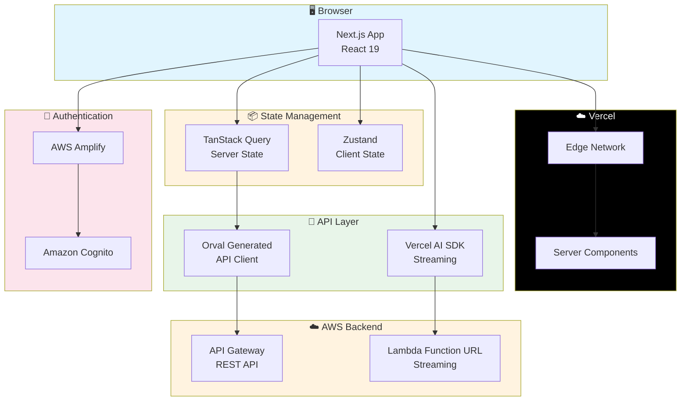

# Myelin Base - Frontend

<p align="center">
  
  
  
  
  
</p>

## 🌐 Live Demo

| 環境 | URL |
|------|-----|
| **アプリケーション** | [https://myelinbase.com](https://myelinbase.com) |
| **API エンドポイント** | `https://api.myelinbase.com` |

> 📦 **関連リポジトリ**: [myelinbase-backend](https://github.com/r-serori/myelinbase-backend) - AWS Serverless バックエンド

---

ドキュメントをアップロードしてAIとチャットできる、RAG（Retrieval-Augmented Generation）プラットフォームのフロントエンドです。

## ✨ 主な機能

- 📄 **ドキュメント管理** - ドラッグ&ドロップでアップロード、タグ管理、一覧表示
- 💬 **AIチャット** - リアルタイムストリーミングによる滑らかな応答体験
- 🔐 **認証** - AWS Cognito連携による安全なログイン/サインアップ
- 📱 **レスポンシブ** - PC/タブレット/モバイル対応

## 🏗️ アーキテクチャ



### 📁 プロジェクト構造

```
frontend/
├── src/
│   ├── app/                    # Next.js App Router
│   │   ├── chat/              # チャットページ
│   │   ├── documents/         # ドキュメント管理
│   │   ├── login/             # ログイン
│   │   └── register/          # 新規登録
│   ├── features/              # 機能別モジュール (Feature-based)
│   │   ├── auth/              # 認証機能
│   │   ├── chat/              # チャット機能
│   │   └── documents/         # ドキュメント管理
│   ├── components/ui/         # 共通UIコンポーネント
│   ├── hooks/                 # 汎用カスタムフック
│   ├── lib/api/generated/     # Orval生成APIクライアント
│   └── providers/             # Context Providers
├── e2e/                       # Playwright E2Eテスト
│   ├── specs/                 # テストスペック
│   └── pom/                   # Page Object Model
└── public/                    # 静的ファイル
```

---

## 📋 目次

- [技術スタック](#-技術スタック)
- [前提条件](#-前提条件)
- [セットアップ](#-セットアップ)
- [開発](#-開発)
- [ビルド・デプロイ](#-ビルドデプロイ)
- [テスト](#-テスト)
- [APIコード生成](#-apiコード生成)
- [コントリビューション](#-コントリビューション)

## 🛠 技術スタック

| カテゴリ | 技術 |
|----------|------|
| **フレームワーク** | [Next.js](https://nextjs.org/) 16 (App Router) |
| **言語** | [TypeScript](https://www.typescriptlang.org/) 5.x |
| **UIライブラリ** | [React](https://react.dev/) 19 |
| **スタイリング** | [Tailwind CSS](https://tailwindcss.com/) 4 |
| **状態管理** | [TanStack Query](https://tanstack.com/query) (Server State) |
| **認証** | [AWS Amplify](https://aws.amazon.com/amplify/) |
| **AI統合** | [Vercel AI SDK](https://sdk.vercel.ai/) 3.x |
| **APIクライアント** | [Orval](https://orval.dev/) (自動生成) |
| **テスト** | [Vitest](https://vitest.dev/), [Playwright](https://playwright.dev/) |
| **モック** | [MSW](https://mswjs.io/) (Mock Service Worker) |

## 📦 前提条件

- Node.js 20以上
- npm または yarn
- AWS Amplifyの設定（認証機能を使用する場合）

## 🚀 セットアップ

### 1. 依存関係のインストール

```bash
npm install
```

### 2. 環境変数の設定

`.env.local` ファイルを作成し、必要な環境変数を設定してください。

```bash
# .env.local の例
NEXT_PUBLIC_API_BASE_URL=http://localhost:3000

# AWS Amplify設定
NEXT_PUBLIC_AWS_REGION=ap-northeast-1
NEXT_PUBLIC_COGNITO_USER_POOL_ID=your-pool-id
NEXT_PUBLIC_COGNITO_APP_CLIENT_ID=your-client-id

# E2Eテスト用（オプション）
E2E_TEST_EMAIL=test@example.com
E2E_TEST_PASSWORD=TestPassword123
```

### 3. APIコードの生成

バックエンドのOpenAPI仕様からAPIクライアントを自動生成します。

```bash
npm run orval
```

## 💻 開発

### 開発サーバーの起動

```bash
npm run dev
```

開発サーバーは `http://localhost:3001` で起動します。

### 利用可能なスクリプト

```bash
npm run dev      # 開発サーバー起動
npm run build    # プロダクションビルド
npm start        # プロダクションサーバー起動
npm run lint     # ESLint実行
npm test         # ユニットテスト実行
npm run orval    # APIコード生成
```

## 🚢 ビルド・デプロイ

### デプロイ環境

このプロジェクトは [Vercel](https://vercel.com/) にデプロイされています。

| 環境 | ブランチ | 自動デプロイ |
|------|---------|-------------|
| **Production** | `main` | ✅ |
| **Preview** | その他 | ✅ |

## 🧪 テスト

### ユニットテスト

```bash
npm test
```

### E2Eテスト

```bash
# テスト実行
npx playwright test

# UIモードで実行
npx playwright test --ui

# レポート表示
npx playwright show-report
```

## 🔧 APIコード生成

バックエンドのOpenAPI仕様から以下を自動生成します：

- **React Query フック**: API呼び出し用カスタムフック
- **Zodスキーマ**: バリデーション用スキーマ

```bash
npm run orval
```

生成コードは `src/lib/api/generated/` に配置されます。

## 🤝 コントリビューション

詳細は [CONTRIBUTING.md](./CONTRIBUTING.md) を参照してください。

## 📄 ライセンス

MIT License - 詳細は [LICENSE](./LICENSE) を参照してください。